# UAH Fee Calculator User Manual
 This document will outline a complete guide on how to use the UAH Fee Calculator.

# Section One: Navigating the UI
The general UI of the fee calculator is very simple:

First, you will load the page and see a window like this

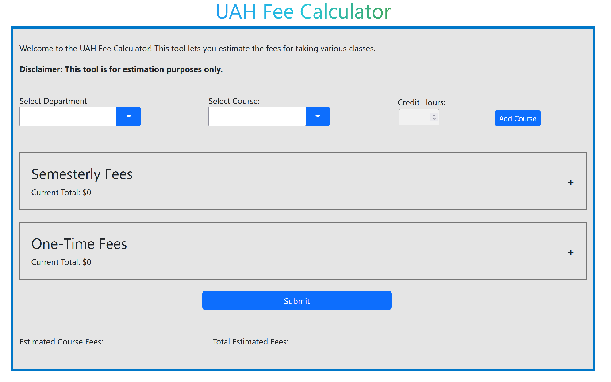 

let's break this image down and discuss how to fill out this form.

>In the image above we see:
> - 2 drop down boxes
> - a credit hours box
> - an add course button

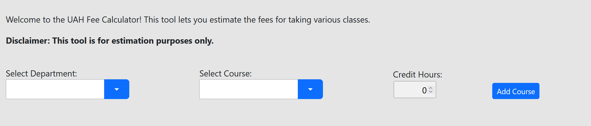

To use the fee calculator and have it display the expected fees for the students you first have to add the appropriate courses for the student.

We do this by clicking on the first dropdown box and either typing in the department name or finding the appropriate department name in the list and clicking on that option.

 
>The above image is an example of the user selecting the EH department

Next, you want to select the appropriate course number to add to the schedule. We do this in the same way as before.

>The above image is an example of the user selecting the EH 301 course

**Notice:** The credit hour selection automatically gets populated based on the course selected. 

Some courses have varying credit hours, such as special topics. The number of credit hours for any course can be modified as needed.

>To update the credit hours simply click on the up/down arrows accordingly. (pictured below)

After you have made your selections press the "add course" button on the right. Repeat these steps as many times as you want until you have added your full class schedule. (pictured below)

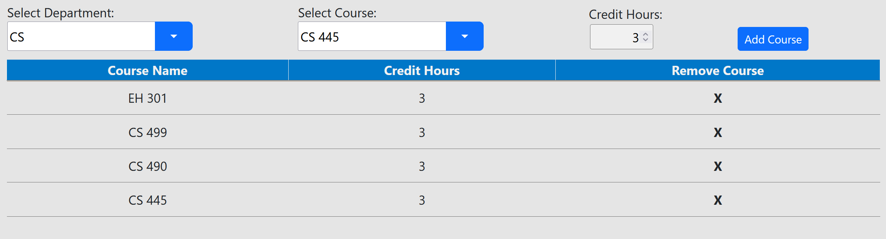

>If you made a mistake and need to remove a class from the schedule just press the "**X**" button on the far right under the "Remove Course" column.

Once that is complete, you can now add any "Semesterly Fees" and "One-Time Fees" **(if applicable)** to the fee calculator.

>Examples of adding these fees are illustrated below:
> - **Notice:** at first the two tabs will be minimized simply click the "**+**" to expand the section.

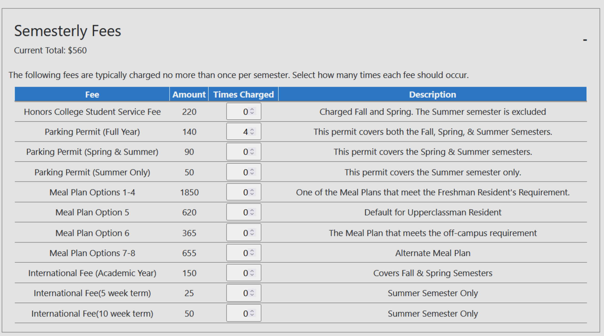

>The image above shows that the user has selected 4 parking permits.
>The total fee of the 4 permits can be seen in the top left of the "Semesterly Fees" window.

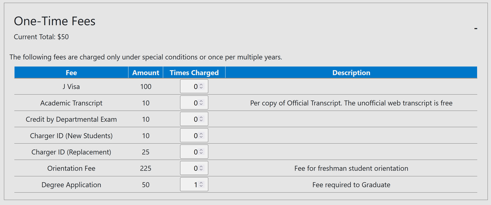

>The image above shows that the user has selected a Degree Application Fee of $50.
>Again the total one-time fees can be seen in the top left of the "One-Time Fees" window.

When you are done adding your changes to the form press the submit button to generate your fees. 
(the output will look similar to the image below)

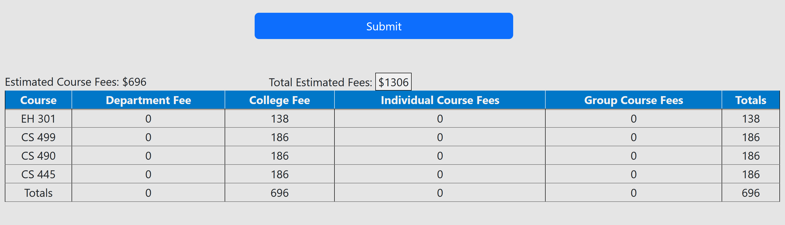

# Section Two: Excel Editing Guide
- **Our Spread Sheet Layout**

	>When you first open our spreadsheet you will see six tabs at the bottom of your Excel document (pictured below) these tabs are labeled as followed: **Departments, Colleges, Individual Course Fees, Group Course Fees, Semester Fees, and One-time Fees**
throughout the rest of this section we will outline in more detail what each tab represents.

## **Departments**

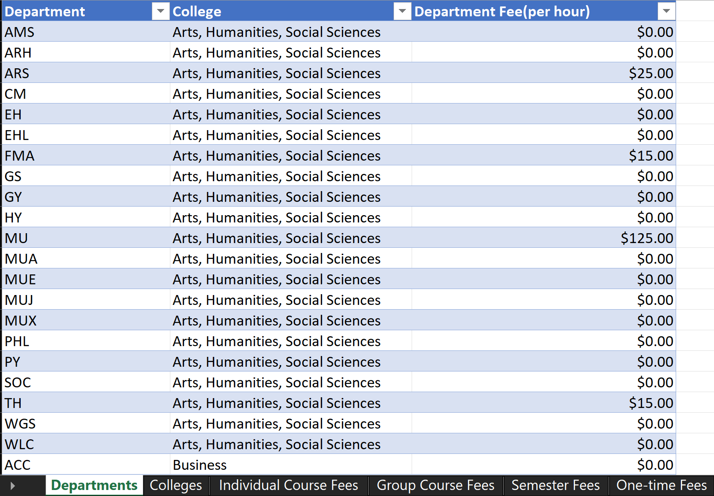

In this tab we have pulled a list of all the departments at UAH as well as their respective college they are apart of as well as the fees that are applied to that specific department if applicable.
- **Editing data in this tab**
	>To **edit** data in this tab all you need to do is **double click** in the cell you want to edit then make your changes to the cell. 
	>
	> **Be sure to save your edits!**

- **Adding new data to this tab**

	>To **add** data to this tab all you need to do is enter the data of the new Department on a **new line** of the spreadsheet
	>
	>this includes:
	>
	>- the Department name under the **Departments** header i.e( CS ) 
	>
	> - the College name under the **College** header i.e( Science ) 
	>
	> - the department fee if applicable under the **Department Fee(per hour)** header 
	> 
	>  (**note:** that the Department Fee is represented **Per Student Credit Hour**) and as always **be sure to save your new additions** 

## **Colleges**

In this tab we have pulled a list of all of the colleges at UAH and have listed the respective **College Fee** for the College. **Note:** the **College Fee** listed here is represented **Per Student Hour** 
- **Editing data in this tab**
	> To **edit** data in this tab all you need to do is **double click** in the cell you want to edit then make your changes to the cell. 
	>
	>**Be sure to save your edits!**

- **Adding data in this tab**
	> To **add** data to this tab all you need to do is enter the data of the new College on a **new line** of the spreadsheet 
	>
	>this includes:
	>
	>- the College name under the **College** header i.e( Science )
	>
	>- the College fee if applicable under the **College Fee(per hour)** header 
	>
	>(**note again :** that the Department Fee is represented **Per Student Credit Hour**) and as always **be sure to save your new additions** 

## **Individual Courses**

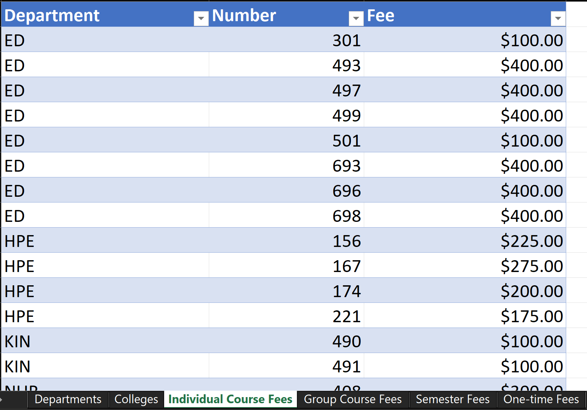

In this tab we have pulled into a spreadsheet all of the courses that have separate **individual Fees** on top of course fees and college fees 
- **Editing data in this tab**
	> To **edit** data in this tab all you need to do is **double click** in the cell you want to edit then make your changes to the cell. 
	>
	>**Be sure to save your edits!**

- **Adding data in this tab**
	> To **add** data to this tab all you need to do is enter the data of the new College on a **new line** of the spreadsheet 
	>
	>this includes:
	>
	>- the Department name under the **Department** header i.e( CS )
	>
	>- the Course number under the **Number** header i.e(499)
	>
	>- the fee to be applied under the **Fee** header 
	>
	>(**note:** that this Fee is **NOT** represented **Per Student Credit Hour** and is a flat one time fee to be applied for the course) and as always **be sure to save your new additions** 

## **Group Course Fees**

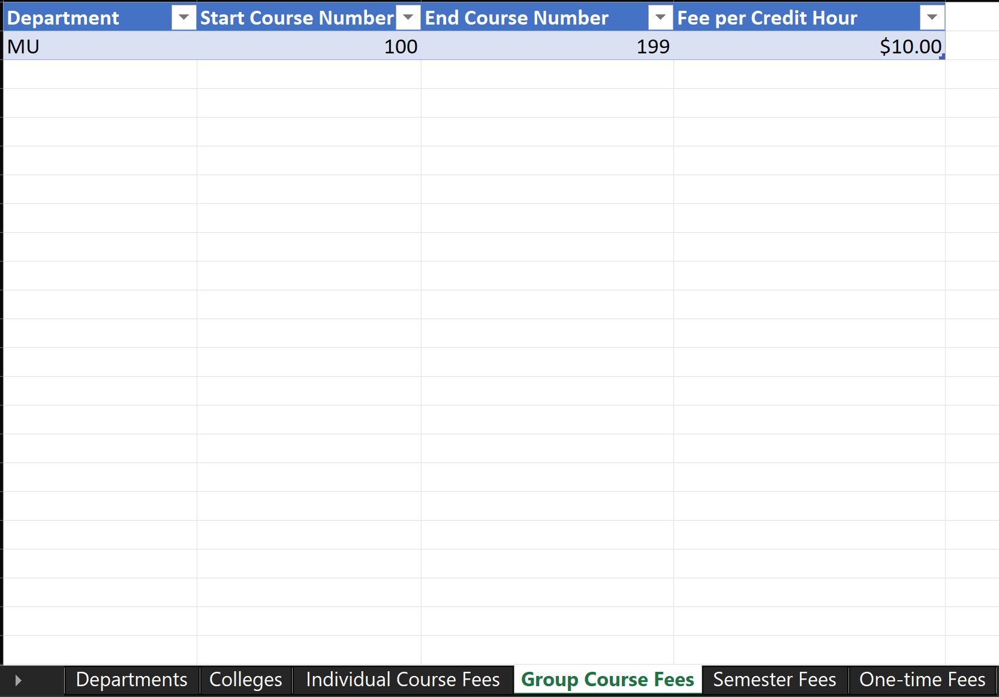

In this tab we have gathered all the Departments and courses into a spreadsheet that have group fees. This means that the same fee will be applied to all course numbers within a specific range in a certain department.

- **Editing data in this tab**
	> To **edit** data in this tab all you need to do is **double click** in the cell you want to edit then make your changes to the cell. 
	>
	>**Be sure to save your edits!**

- **Adding data in this tab**
	> To **add** data to this tab all you need to do is enter the data of the new department group on a **new line** of the spreadsheet 
	>
	>this includes:
	>
	>- the Department name under the **Department** header i.e( CS )
	>
	>- the start course number under the **Start Course Number** header i.e( 400 ) 
	>
	>- the end course number under the **End Course Number** header i.e( 499 )
	>
	>- the fee to be applied under the **Fee per Credit Hour** header 
	>
	>(**note:** that this Fee is represented **Per Student Credit Hour**) and as always **be sure to save your new additions** 

## **Semester Fees**

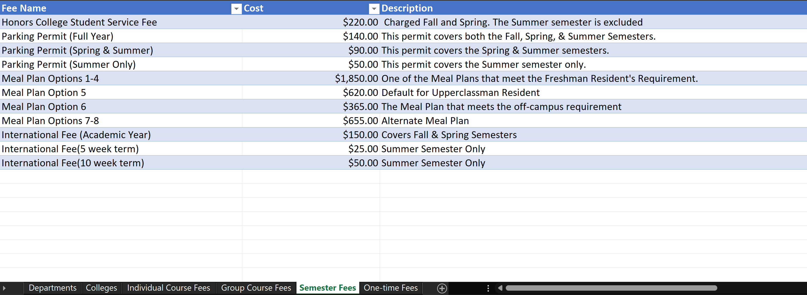

In this tab we have bundled all of the fees at UAH that are applied per a certain semester i.e( Parking Permits, Meal plan options, International student fees, honors college)  

- **Editing data in this tab**
	> To **edit** data in this tab all you need to do is **double click** in the cell you want to edit then make your changes to the cell. 
	>
	>**Be sure to save your edits!**

- **Adding data in this tab**
	> To **add** data to this tab all you need to do is enter the data of the new Semester Fee on a **new line** of the spreadsheet
	>
	> this includes:
	>
	>- the name of the semester fee under the **Fee Name** header i.e( Honors College ) 
	>
	>- the Fee Cost under the **Cost** header i.e( $420.69 ) 
	>
	>	- (**note:** that this Fee is **NOT** represented **Per Student Credit Hour** and is a flat one time fee to be applied to the Student Account) 
	>
	>- the semester in which the fee is to be applied, under the **Semester Applied** header 
	>
	>(**note:** that you do **NOT** have to specify which semester the fee will be applied if you have a fee that can happen multiple times per semester like a Meal Plan) and as always **be sure to save your new additions** 

## **One- Time Fees**

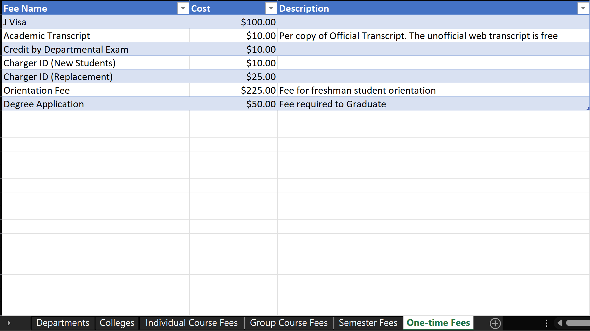

In this tab we have bundled all of the one time fees at UAH i.e( J visa, Academic Transcript, Credit by Department Exam, Charger ID (New Students), Charger ID (Replacement))
- **Editing data in this tab**
	> To **edit** data in this tab all you need to do is **double click** in the cell you want to edit then make your changes to the cell. 
	>
	>**Be sure to save your edits!**

- **Adding data in this tab**
	> To **add** data to this tab all you need to do is enter the data of the new One Time Fee on a **new line** of the spreadsheet
	>
	>this includes:
	>
	>- the name of the fee under the **Fee Name** header i.e( Charger ID (Replacement)
	>
	>- the Fee Cost under the **Cost** header i.e( $25.00)  
	>
	>and as always **be sure to save your new additions** 

## **Example of Adding Data to the Spreadsheet**

In the figure below we see an example of adding a new line of data to the spreadsheet.

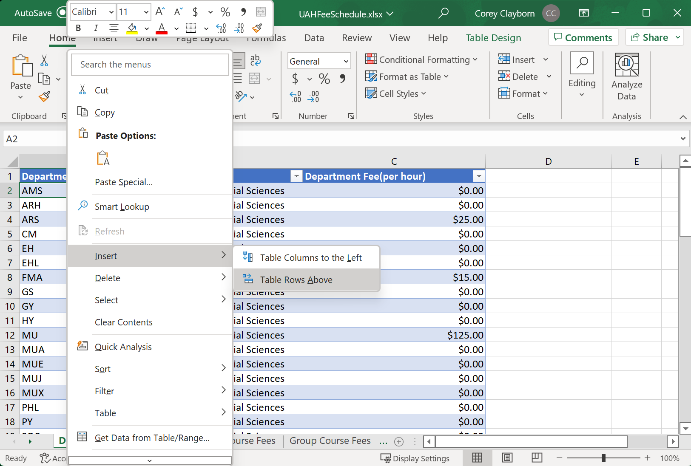

> To see these selections appear you must: 
**right click** the cell below you want to add a new line > move your cursor over the **insert** selection and **left click** the selection > move your cursor over the **Table Rows Above** selection and **left click** the option.

If you choose to add the data to the end of the file the calculator will still work. However, if you want to clean up the formatting of the document after you do so, all you have to do is sort the table first by College then by Department in the figures below we will demonstrate this.

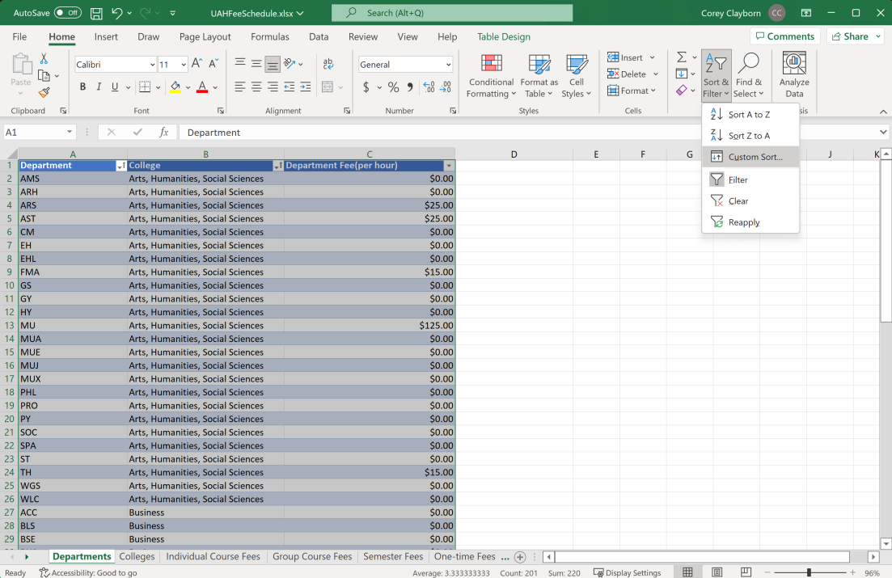 

>  To see these selections appear you must:
**left click** sort & filter > **left click** on the custom sort selection
 
> To format the table correctly you should edit your custom sort selections as demonstrated in the figure below:  

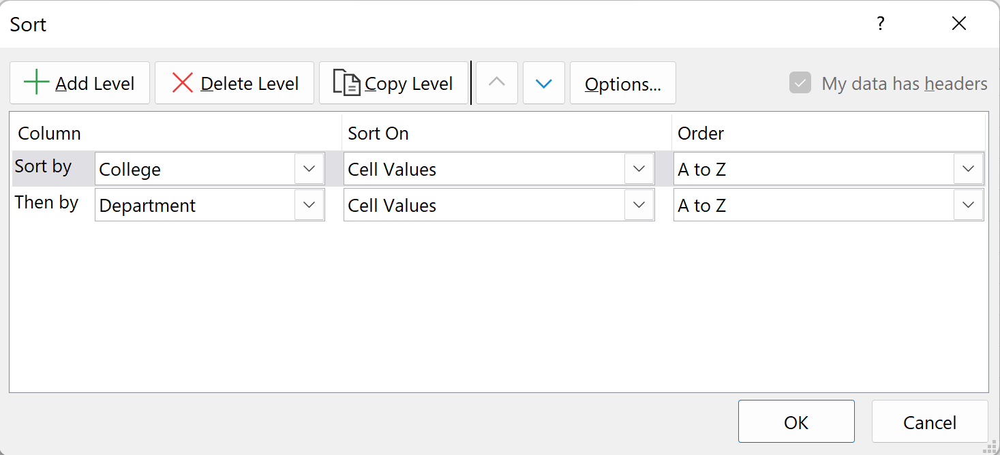 
