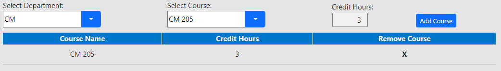
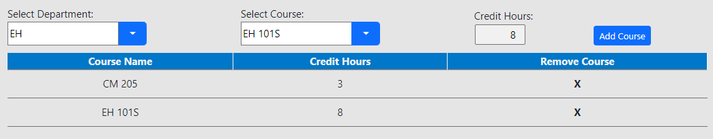
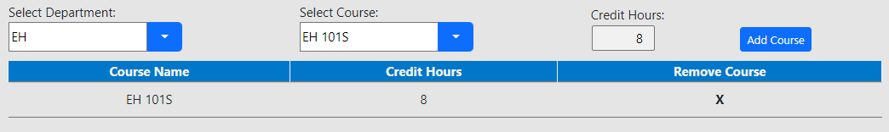
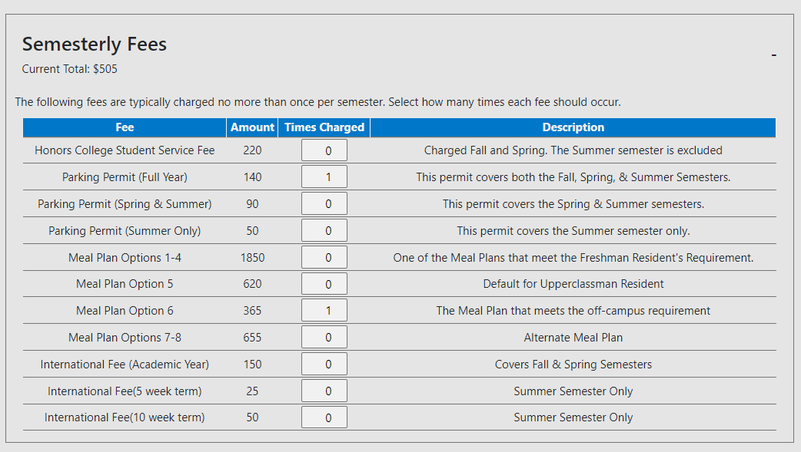
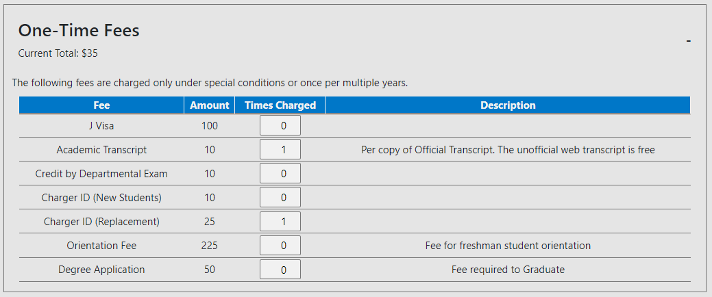
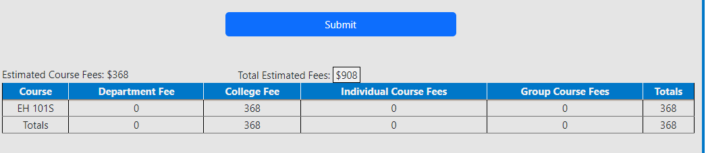
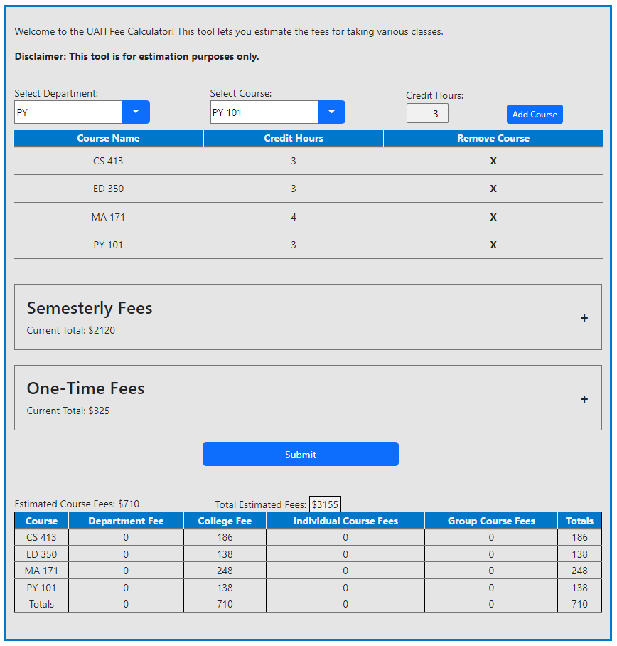

# Manual Use Cases

***

## Enter a Course (e.g. CM 205)

1.  Click empty box under "Select Department" and begin to type "CM" then select the option "CM" when it is available.

2.  Click empty box under "Select Course" and start typing course number "205" then select option "CM 205" when it is available.

3.  Verify "Credit Hours" has been auto-filled to "3"

4.  Click blue "Add Course" button to see course information displayed below.

5.  Verify the course is added with name "CM 205" and credit hours of "3"

***

## Edit Credit Hours of Course (e.g. EH 101S )

1.  Under "Select Department" choose "EH" and under "Select Course" choose "EH 101S"

2.  In "Credit Hours" box use arrows to increase/decrease credit hours

3.  Use up arrow to change credit hours to 8 and then click "Add Course"

4.  Verify the course "EH 101S" has been added with 8 credit hours

## Remove a Course from Fee Calculation (e.g. CM 205)

1.  Continuing from previous step click the "X" button under "Remove Course" for "CM 205"

2.  Verify that course information disappears and only "EH 101S" remains

## Add Semesterly Fees
1. Click the "Semesterly Fees" box and verify it drops down
2. Change "Times Charged" to 1 by using the up arrow in the box for "Parking Permit (Full Year)" and "Meal Plan Option 6" 
3. Verify Semesterly Feees "Current Total" is now "$505"

## Add One-Time Fees
1. Click the "One-Time" box and verify it drops down
2. Change "Times Charged" to 1 by using the up arrow in the box for "Academic Transcript" and "Charger ID (Replacement)" 
3. Verify One-TIme Feees "Current Total" is now "$35"

## Submit Courses and Fees to Fee Calculation
1. Continuing from previous steps, click the blue "Submit" button under "One-Time Fees"
2. Verify course "EH 101S" with credit hours 8 is added to the list with a total fee of "$368"
3. Verify "Estimated Course Fees" is "$368" and Total Estimated Fees" is "$908" (Course Fee + Semesterly Fee + One-Time Fee -> 368 + 505 + 35 = 908)

## Without Refreshing Remove Everything and Add More Fees
1. Remove all courses in list and change Semesterly and One Time fees to "0"
2. Add Courses "CS 413", "ED 350", "MA 171", and "PY 101"
3. Add Semesterly Fees of "Honors College Student Service Fee", "Meal Plan Options 1-4", and "International Fee (10 week term)"
4. Add One-Time Fees "J visa" and "Orientation Fee"
5. Verify all 4 courses have been added, semester fees current total is "$2120", one-time fees current total is "$325", estimated course fees is "710", and total estimated fees is "$3155"

